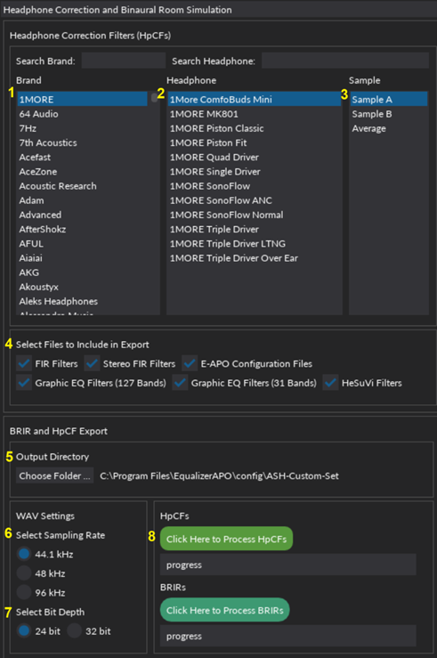
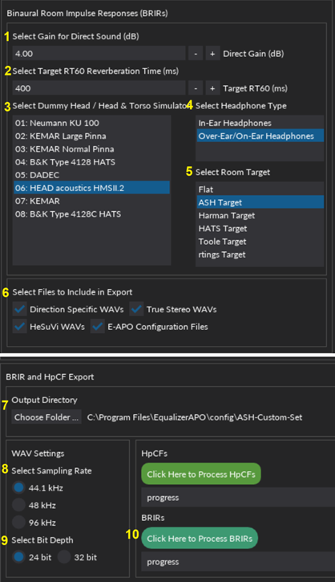

# ASH Toolset
The Audio Spatialisation for Headphones Toolset is a set of tools for headphone correction and binaural synthesis of spatial audio systems on headphones


## Features  
- **Headphone Correction** — Generate Headphone correction filters (HpCFs) in WAV format for IR convolution or for graphic equalisers
- **Binaural Room Simulation** —  Generate customised Binaural Room Impulse Responses (BRIRs) in WAV format for IR convolution
- **Equalizer APO Compatibility** —  Generates configuration files to load HpCFs and BRIRs in Equalizer APO, an audio processing object for windows.
- **HeSuVi Compatibility** —  Generates BRIRs and HpCFs in formats compatible with HeSuVi, a headphone surround virtualization tool for Equalizer APO.

## Getting Started

ASH Toolset is a python app built with Python, Numpy, Scipy, & DearPyGui.\
Developed on Python 3.11.\
Tested on Windows 10 and Windows 11.

### Prerequisites

Python libraries:
  ```sh
  pip install dearpygui
  pip install dearpygui_ext
  pip install dearpygui-extend
  pip install mat73
  pip install matplotlib
  pip install numpy
  pip install pyfar
  pip install scipy
  pip install soundfile
  ```
Data files:

HRIR, BRIR and filter datasets are required in the data folder to run the app. Due to large file sizes the data files are stored using google drive.\
[Link to data folder](https://drive.google.com/drive/folders/1Yp3NQoxPji8y_DrR8azFvbteml8pTscJ?usp=drive_link)

Optional:
- [Equalizer APO](https://sourceforge.net/projects/equalizerapo/), an audio processing object for windows featuring IR convolution and Graphic EQ capabilities.
- [HeSuVi](https://sourceforge.net/projects/hesuvi/), a headphone surround virtualization tool for Equalizer APO.

  
### Installation

1. Clone the repo
2. Download the data folder from google drive
3. Extract data folder to ASH-Toolset root folder
4. (optional) If using Equalizer APO for the first time, download [Equalizer APO](http://sourceforge.net/projects/equalizerapo) and follow the Equalizer APO [installation tutorial](https://sourceforge.net/p/equalizerapo/wiki/Documentation/#installation-tutorial). 


## Usage

Run the ash_toolset.py using python to launch the GUI
```sh
python C:\sample-location\ASH-Toolset\ash_toolset.py
```

### Generate HpCFs for headphone correction
This part of the app is used to generate a set of HpCFs for a selected headphone and export to files which can then be loaded into audio processing software to apply headphone correction.
1. Select a headphone brand to filter down on the headphone list
2. Select a specific headphone
3. One or more samples will be available for the specified headphone. Select one to preview the filter response. Note that all samples will be exported for the selected headphone.
4. Select which files to include in the export
   - FIR Filters: Minimum phase WAV FIRs for convolution. 1 Channel, 24 bit depth, 44.1Khz
   - stereo FIR Filters: Minimum phase WAV FIRs for convolution. 2 Channels, 24 bit depth, 44.1Khz
   - E-APO Configuration files: configuration files that can be loaded into Equalizer APO to perform convolution with FIR filters
   - Graphic EQ Filters: Graphic EQ configurations with 127 bands. Compatible with Equalizer APO and Wavelet
   - Graphic EQ Filters (31 bands): Graphic EQ configurations with 31 bands. Compatible with 31 band graphic equalizers including Equalizer APO
   - HeSuVi Filters: Graphic EQ configurations with 127 bands. Compatible with HeSuVi. Saved in HeSuVi\eq folder
5. Select a location to export files to. Default location is in the Equalizer APO config directory (e.g. C:\Program Files\EqualizerAPO\config\ASH-Custom-Set), which is the recommended location if using Equalizer APO. HeSuVi files will be saved in the EqualizerAPO\config\HeSuVi directory.
6. Click the process HpCFs button to export the selected HpCFs to above directory



### Generate BRIRs for binaural room simulation
This part of the app is used to generate a set of customised BRIRs and export to WAV files which can then be loaded into audio processing software to apply binaural room simulation.
1. Select Gain for Direct Sound in dB. Select a value between -8dB and 8dB. Higher values will result in lower perceived distance. Lower values result in higher perceived distance
2. Select Target RT60 Reverberation Time in ms. Select a value between 200ms and 1250ms. Higher values will result in more late reflections and larger perceived space.
3. Select Dummy Head / Head & Torso Simulator from available options:
   - KU_100
   - KEMAR_Large
   - KEMAR_Normal
   - B&K_4128
   - DADEC
   - HMSII.2
   - KEMAR
   - B&K_4128C
5. Select Headphone Type from options:
   - In-Ear Headphones
   - Over-Ear/On-Ear Headphones
6. Select Room Target from available options:
   - Flat
   - ASH Target
   - Harman Target
   - HATS Target
   - Toole Target
   - rtings Target
7. Select which files to include in the export
   - Direction specific WAVs: Directional WAV BRIRs for convolution. 2 Channels, 24 bit depth, 44.1Khz
   - True Stereo WAVs: True Stereo WAV BRIRs for convolution. 4 Channels, 24 bit depth, 44.1Khz
   - HeSuVi WAVs: HeSuVi compatible WAV BRIRs. 14 Channels, 24 bit depth, 44.1Khz and 48Khz
   - E-APO Configuration Files: configuration files that can be loaded into Equalizer APO to perform convolution with BRIRs
8. Select a location to export files to. Default location is in the Equalizer APO config directory (e.g. C:\Program Files\EqualizerAPO\config\ASH-Custom-Set), which is the recommended location if using Equalizer APO. HeSuVi files will be saved in the EqualizerAPO\config\HeSuVi directory.
9. Click the process BRIRs button to generate and export the customised BRIRs to above directory. This may take a minute to run.



### Apply HpCFs and BRIRs in Equalizer APO

1. Set your sound device's default format to 44100Hz under the properties of your playback device. In Windows 10 the playback device settings can be found in Settings -> System -> Sound -> Sound control panel.
2. In the configuration editor, add a new `Include` command to your `config.txt` file, then navigate to the `EqualizerAPO\config\ASH-Custom-Set\E-APO-Configs\HpCF-Convolution` folder and select the desired configuration file for headphone correction.
3. In the configuration editor, add a new `Include` command to your `config.txt` file, then navigate to the `EqualizerAPO\config\ASH-Custom-Set\E-APO-Configs\BRIR-Convolution` folder and select the desired configuration file for binaural room simulation.
4. To swap out a HpCF or BRIR, simply load a different configuration file.


# License
ASH-Toolset is distributed under the terms of the GNU Affero General Public License v3.0 (AGPL-3.0). A copy of this license is provided in the file LICENSE.

## Contact

Shanon Pearce - srpearce55@gmail.com

Project Link: [https://github.com/ShanonPearce/ASH-Toolset](https://github.com/ShanonPearce/ASH-Toolset)

## Acknowledgments

### Libraries
* [DearPyGui](https://github.com/hoffstadt/DearPyGui/tree/master)
* [DearPyGui Ext](https://github.com/hoffstadt/DearPyGui_Ext)
* [DearPyGui Extend](https://github.com/fabriciochamon/DearPyGui_Extend)
* [numpy](https://numpy.org/)
* [scipy](https://scipy.org/)

### Datasets
This project makes use of various publically available HRIR and BRIR datasets. Refer to the sheets provided in the `ASH-Toolset\docs` folder for information on the raw datasets used in this project
